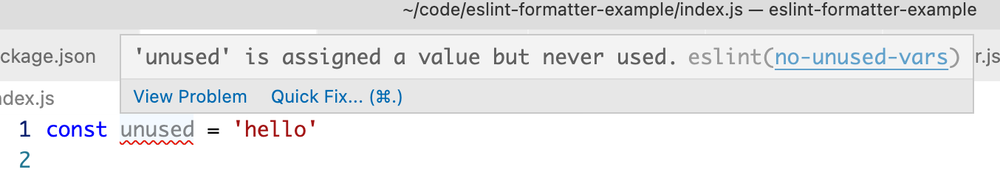
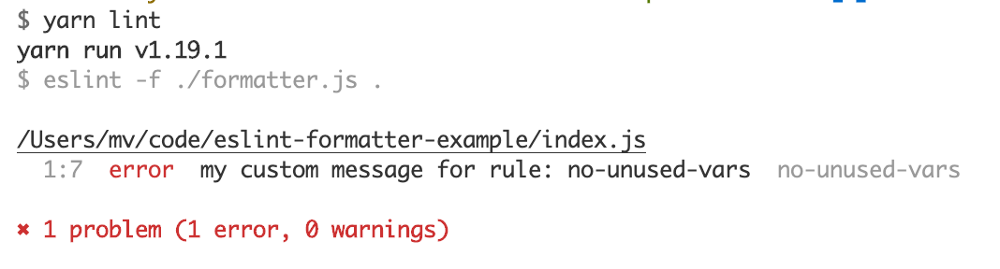

# Demo Repo

illustrates the issue in https://github.com/microsoft/vscode-eslint/issues/1532

Plugin             |  Script Output (run `yarn lint`)
:-------------------------:|:-------------------------:
  |  

See how the error displayed in the plugin is missing the message prefix indicated [by the formatter](./formatter.js#L9)
